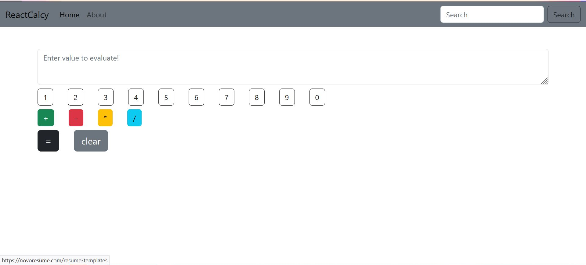

# React-Calculator
A web app which is use to perform simple arithmetic operation and it is completely based on React JS library.

# pre-requisite

- NodeJS
- NPM

# Steps to run on localhost

- Download everything on your machine
- Open terminal for the folder where files are saved
- Run command 

`npm install`

then

`npm start`